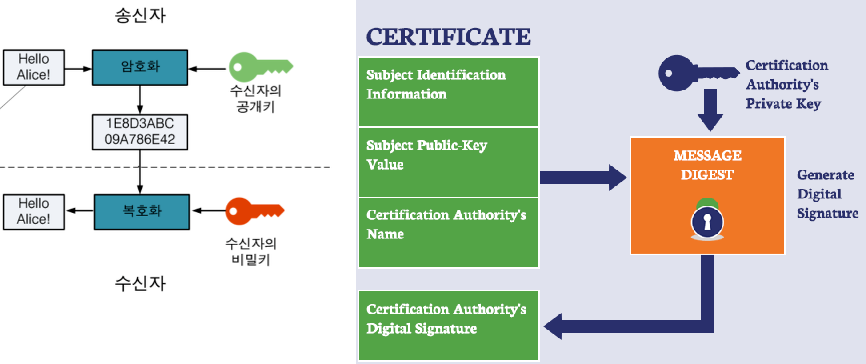

# HTTP와 HTTPS

## HTTP
- HTTP(Hyper Text Transfer Protocal)이란 서버/클라이언트 모델을 따라 데이터를 주고 받기 위한 프로토콜이다.
- HTTP는 애플리케이션 레벨의 프로토콜로 TCP/IP 위에서 작동합니다.
- HTTP는 상태를 가지고 있지 않는 Stateless 프로토콜이며 Method, Path, Version, Headers, Body 등으로 구성됩니다.

  

---
## HTTPS
- HTTP는 평문 데이터를 전송하는 프로토콜이기 때문에, HTTP로 비밀번호나 주민번호 등을 주고 받으면 제3자에 의해 조회될 수 있는 위험이 있다.
- 이러한 문제를 해결하기 위해 HTTP에 암호화가 추가된 프로토콜이 HTTPS이다.
- HTTPS는 자신의 공개키를 갖는 인증서를 발급하여 보내는 메세지를 공개키로 암호화를 한다.   
  공개키로 암호화된 메세지는 개인키를 가지고 있어야만 복호화가 가능하기 때문에, 기업을 제외한 누구도 원본 데이터를 얻을 수 없다.
  
