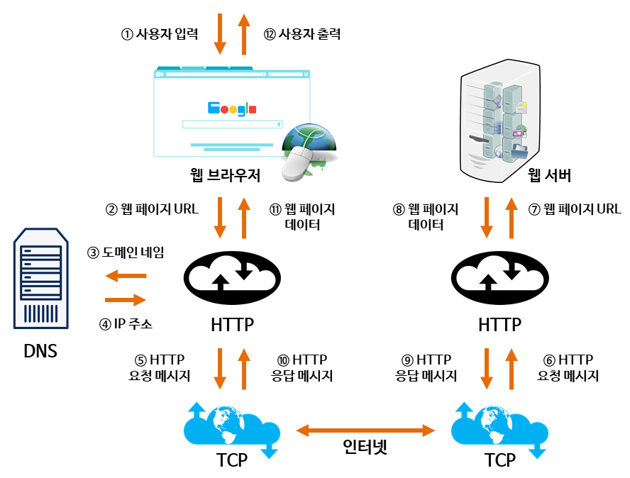

# 간단 웹 동작 방식

1. 사용자가 브라우저에 URL을 입력한다.
2. 브라우저는 DNS를 통해 서버의 진짜 주소를 찾아서 반환해준다.
3. HTTP 프로토콜을 사용하여 HTTP Request(요청) 메세지를 생성한다.
4. TCP/IP 연결을 통해 HTTP 요청이 서버로 전송된다.
5. 서버는 HTTP 프로토콜을 활용해 HTTP Response(응답) 메세지를 생성한다.
6. TCP/IP 연결을 통해 요청한 사용자에게 전송한다.
7. 도착한 HTTP 응답 메세지는 웹페이지 데이터로 변환되고, 웹 브라우저에 의해 출력되어 사용자가 볼 수 있게 된다.