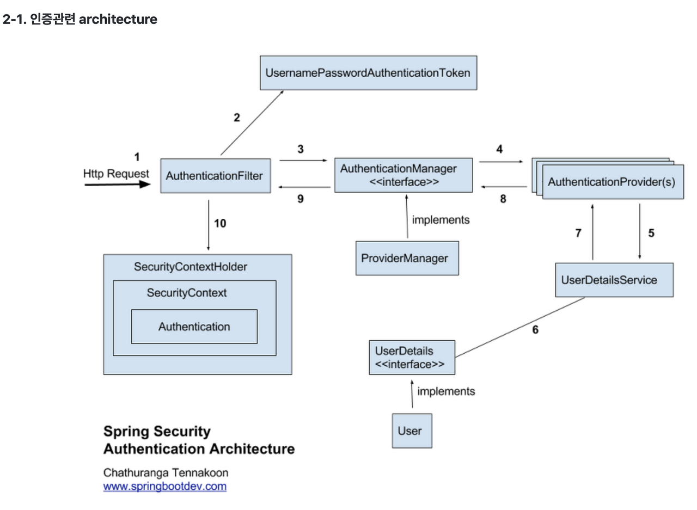

# 스프링 시큐리티(Spring Security)

## 동작방식

### 1. HTTP 요청 수신(Http Request) 및 AuthenticationFilter 통과
- AuthenticationFilter는 사용자의 세션ID(JSESSIONID)가 Security Context에 있는지 확인한다.
- Security Context란 인증이 완료된 사용자의 정보(인증 개체)를 저장하는 공간이다.

### 2. 사용자 자격 증명을 기반으로 AuthenticationToken 생성
- 인증 요청(request)이 관련 AuthenticationFilter에 의해 수신되면 수신된 요청에서 사용자이름과 비밀번호를 추출한다.
- 추출한 사용자 자격 증명(credentials)을 기반으로 UsernamePasswordAuthenticationToken을 생성한다.

### 3. AuthenticationManager를 위해 생성된 AuthenticationToken 위임
- UsernamePasswordAuthenticationToken은 AuthenticationManager의 인증 메서드를 호출하는데 사용된다.
   - 여기서 AuthenticationManager는 단순한 인터페이스이며 실제 구현은 ProviderManager이다.
- ProviderManager 에는 사용자 요청을 인증에 필요한 AuthenticationProvdier 목록이 있다.
- ProviderManager는 제공된 각 AuthenticationProvdier를 살펴보고 전달된 인증 개체(UsernamePasswordAuthenticationToken)를 기반으로 사용자 인증을 시도한다.

### 4. AuthenticationProvider 목록으로 인증 시도
- AuthenticationProvider는 제공된 인증 개체(UsernamePasswordAuthenticationToken)로 사용자를 인증한다.

### 5. UserDetailsService / 6. UserDetails / 7. User
- AuthenticationProvider는 사용자 이름을 기반으로 사용자 세부정보를 검색하기 위해 UserDetailService를 사용한다.
- UserDetailService는 DB에 저장된 회원의 비밀번호와 비교해 일치하면 UserDetails 인터페이스를 구현한 객체를 반환한다.
   - UserDetailService는 Spring Security가 제공해주는 인터페이스이며, UserDetailService의 구현체는 직접 개발해야한다.
      - UserDetailService에 선언되어있는 loadUserByUsername를 오버라이딩해 DB와 비교하는 로직을 직접 구현해야한다.
   
### 8. AuthenticationException
- AuthenticationProvider 인터페이스에 의해 사용자가 성공적으로 인증이 완료되면, 인증개체가 반환된다.
   - 인증에 실패하면 AuthenticaionException이 발생한다.
   
### 9. 인증 완료!
- AuthenticationManager는 완전히 채워진 인증개체를 관련 인증 필터(AuthenticationFilter)로 다시 반환한다.

### 10. SecurityContext에서 인증 개체 설정
- 관련 AuthenticationFilter는 향후 필터 사용을 위해 획득한 인증 개체를 Security Context에 저장한다.